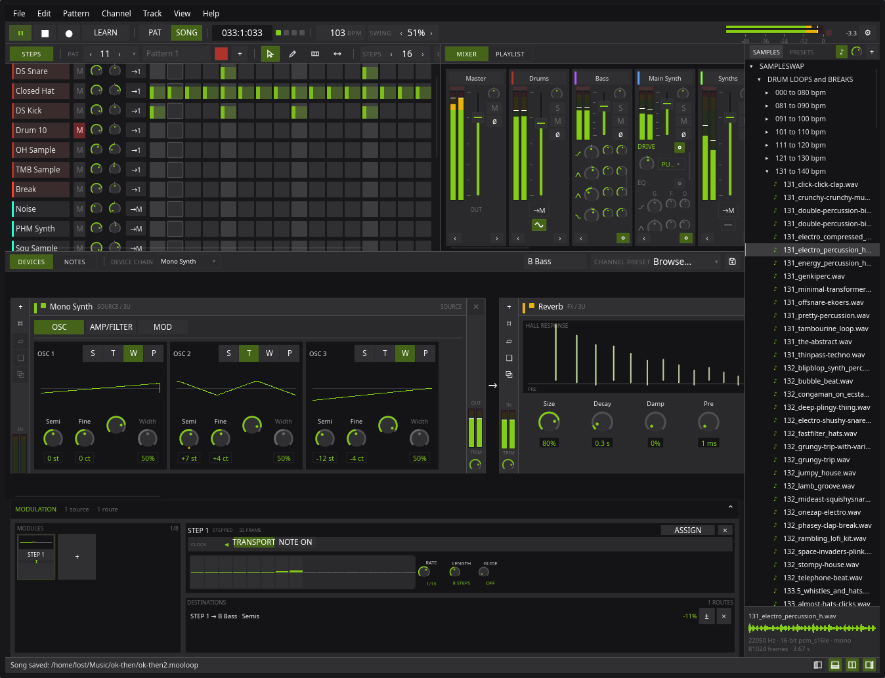

# mooloop

<p align="center">
  
</p>

Mooloop is an experimental, Linux-native, tracker-inspired pattern instrument.
It combines a channel rack, piano roll, playlist, sampler, and small synthesis
engines in a workflow aimed at making rhythm-centered music quickly. It is
written in Rust, uses Slint for the interface, and talks directly to JACK or
PipeWire's JACK compatibility layer.

**Mooloop is also explicitly an experiment in vibe coding.** It has been built
primarily through natural-language collaboration with AI coding agents, guided
by human product decisions, testing, and taste. The point of the project is in
part to find out how far that process can be taken on a technically demanding
realtime audio application. Treat it as experimental software, not as a mature
or dependable production tool.



## What's New In 0.1.1

0.1.1 is the first release after the public 0.1.0 baseline. It makes the
prototype substantially nicer to edit, shape, and configure while keeping the
experiment's limits honest.

- **A fuller effect rack.** Add a seven-band parametric EQ, modulation, a
  generated-room reverb, or the lighter Plate reverb alongside the filter,
  drive, bitcrush, delay, gate, compressor, and limiter. Effect hosts now
  provide bypass, dry/wet blend, input/output trims, reordering, and live
  input/output metering; those same hosts work on channels and mixer buses.
- **Editing that shares one command path.** Reassignable keyboard shortcuts,
  menu actions, and channel/pattern context menus reach the same
  undo-recorded commands. Piano-roll multi-select, Select All, Clear Pattern,
  and pattern clone/delete are now usable instead of placeholder rows.
- **Preferences for the actual instrument.** Audio buffer-size selection,
  appearance settings, and shortcut recording persist; new installs request a
  256-frame JACK buffer by default.
- **A less fussy sampler and piano roll.** The sampler gained waveform
  zoom/scroll, exact trim and loop entry, compact tuning with a note/frequency
  readout, and live voice playheads. Piano-roll zoom moved onto the scrollbars
  for direct pan-and-zoom control.
- **More dependable realtime behavior.** Continuous effect changes are
  smoothed to avoid zipper noise; the realtime thread guards against
  denormal-float CPU stalls; idle effect work and unnecessary UI updates are
  skipped.

0.1.1 still has no general parameter automation, retained-audio buffer,
parallel sends, recording, or metronome. See [Version targets](docs/VERSIONS.md)
for the next outcomes rather than treating those absences as hidden promises.

## What Works

- Up to 256 channels using a sampler, drum synth, mono synth, or poly synth.
- Up to 256 patterns, each from 1 to 256 sixteenth-note steps long.
- A step rack with pitch and velocity data.
- A zoomable piano roll and pinned velocity lane.
- A layered playlist with separate Pattern and Song transport modes.
- Sample loading, folder navigation, waveform display, trim, reverse, and
  forward or ping-pong loops.
- Sampler tuning, ADSR, resonant low-pass filtering, drive, bit reduction, and
  rate reduction.
- A horizontal device rack per channel: one source device followed by an
  insert chain of up to eight effects, added by kind, bypassed, removed, and
  reordered by dragging their headers.
- Eleven effects: seven-band parametric EQ, modulation, low-pass/high-pass
  filter, drive/saturation with four curves, bitcrush, stereo delay with
  digital/tape/reverse behavior, generated-room reverb, Plate reverb, gate,
  compressor, and limiter. Effect chains save with the song.
- A mixer of one master plus sixteen insert buses, toggled into the same pane
  as the step grid. Every channel names a bus; buses carry their own effect
  chain, fader, pan, mute, and live meter, and can feed any other bus in any
  order. Selecting a bus points the device rack at it, so building a chain
  across a group of channels works exactly like building one on a channel.
- Versioned song, kit, channel, and generator-preset bundles with optional
  embedded samples. Every UI setting is bounded to its persistable range, so
  normal use cannot make a save fail; a malformed document instead identifies
  its exact channel, parameter, and allowed range in a persistent error dialog.
- Initial undo/redo for channel structure and piano-roll note edits; menu,
  keyboard, and channel context-menu actions share one command path.
- Offline WAV and MP3 export.
- Sample-accurate event delivery inside JACK blocks.
- A reusable Slint audio-control layer, appearance settings, and peak meters.

## Known Issues And Limitations

- Much of the menu bar is scaffolding. Some file operations work, but many
  menu items are disabled, incomplete, or not wired to an implementation yet.
- Mixer buses are insert points, not sends: a channel feeds exactly one, with
  no parallel send, return, or wet/dry split. Any bus can feed any other, but
  cycles are refused, so there is no feedback routing yet. There are no
  sidechains, external inputs, solo, or per-bus stem export, and buses cannot
  be renamed yet.
- There is no graph-level plugin delay compensation. Effects can report
  latency, and drive declares and internally aligns the 15-frame delay of its
  complete 2x oversampling path, but related signals can still comb-filter if
  they reach the same bus down paths with different effect latency.
- General parameter automation does not exist. Effect parameters are built for
  it — every parameter has a stable ID, a declared range, and a sample-timed
  event path — but nothing drives them yet, so there are no automation lanes,
  LFOs, step modulators, or modulation routing. The lower parameter lane only
  edits velocity, and there are no parameter locks, probability controls, or
  user-facing microtiming controls.
- Mooloop is tracker-inspired, but it is not currently a tracker. In
  particular, there is no tracker-style event editor or hexadecimal command
  and automation entry.
- The proposed retained-audio buffer engine is not implemented. Channels do
  not record or retain their output, and none of the buffer playback,
  mutation, or resampling workflow described in the design documents exists
  in the application yet.
- Editing is still incomplete: undo/redo currently covers channel structure
  and piano-roll notes, but not yet rack steps, patterns, or playlist clips.
  Clipboard is currently channel-only; autosave, crash recovery, dedicated
  missing-sample relinking, and playlist clip dragging are still absent.
- The master, mixer buses, and device hosts have live meters. There is no
  metronome.
- The interface still has interaction and responsive-layout edge cases. Many
  workflows are mouse-first and keyboard navigation is incomplete.
- Linux with JACK or PipeWire's JACK compatibility layer is the only supported
  platform and audio setup.

For the detailed implementation snapshot, including smaller edge cases, see
[docs/CURRENT.md](docs/CURRENT.md).

## Proposed Direction

Mooloop is not intended to become a general-purpose DAW. Its working product
definition is in [docs/PRODUCT.md](docs/PRODUCT.md), with the dependency-ordered
plan in [docs/ROADMAP.md](docs/ROADMAP.md). The control-plane, graph compiler,
realtime executor, timing, and latency contracts are defined in
[docs/AUDIO_ARCHITECTURE.md](docs/AUDIO_ARCHITECTURE.md).

One unproven product hypothesis is an insertable retained-audio buffer: a
channel device that continuously remembers recent audio and exposes its record
and playback heads to patterns and automation. This is a design and planned
spike, not a feature of the current application. The hypothesis is specified
in [docs/BUFFER_ENGINE.md](docs/BUFFER_ENGINE.md).

The approved design for parameter automation and modulation — a per-channel
modulator rack, a modulation matrix, and the parameter model they share — is
in [docs/MODULATION_PLAN.md](docs/MODULATION_PLAN.md). The parameter and
effect groundwork it depends on is in place; the modulators themselves are not
built yet.

Another planned direction is tracker-like automation in the parameter lane,
including compact hexadecimal value or command entry where that representation
is musically useful. The exact interaction and command set have not been
designed, and no part of this workflow is implemented yet.

## Development Setup

Requirements:

- Rust toolchain from `rust-toolchain.toml`.
- JACK development libraries.
- A running JACK server or PipeWire JACK compatibility layer.
- The [`mold`](https://github.com/rui314/mold) linker. On Fedora:

  ```sh
  sudo dnf install mold
  ```

  Verify with `command -v mold`.

When using several Mooloop worktrees, point their Cargo commands at one
machine-local cache so dependencies do not rebuild per worktree:

```sh
export CARGO_TARGET_DIR="${XDG_CACHE_HOME:-$HOME/.cache}/mooloop/cargo-target"
```

Run the application:

```sh
cargo run -p mooloop-app --bin mooloop
```

Run the audio control gallery:

```sh
cargo run -p mooloop-ui --example control-gallery
```

Run the full integration checks for cross-crate or release work. For routine
changes, follow the targeted verification guidance in `AGENTS.md` instead:

```sh
cargo test --workspace
cargo clippy --workspace --all-targets -- -D warnings
```

## Project Documentation

- [Current system](docs/CURRENT.md): what the code does today.
- [Product definition](docs/PRODUCT.md): what Mooloop is trying to become.
- [Roadmap](docs/ROADMAP.md): dependency-ordered future work.
- [Version targets](docs/VERSIONS.md): release milestones and their intended
  outcomes.
- [Audio core architecture](docs/AUDIO_ARCHITECTURE.md): the target boundary
  between editable projects, compiled render plans, and realtime execution.
- [Application structure and flow](docs/ARCHITECTURE.md): a Mermaid map of
  the crates, control plane, realtime audio path, persistence, and export.
- [Modulation plan](docs/MODULATION_PLAN.md): the approved parameter,
  modulation, and effect-suite design.
- [Buffer engine hypothesis](docs/BUFFER_ENGINE.md): the unimplemented
  retained-audio experiment.

## License

Mooloop is free software licensed under the
[GNU General Public License v3.0 or later](LICENSE).
