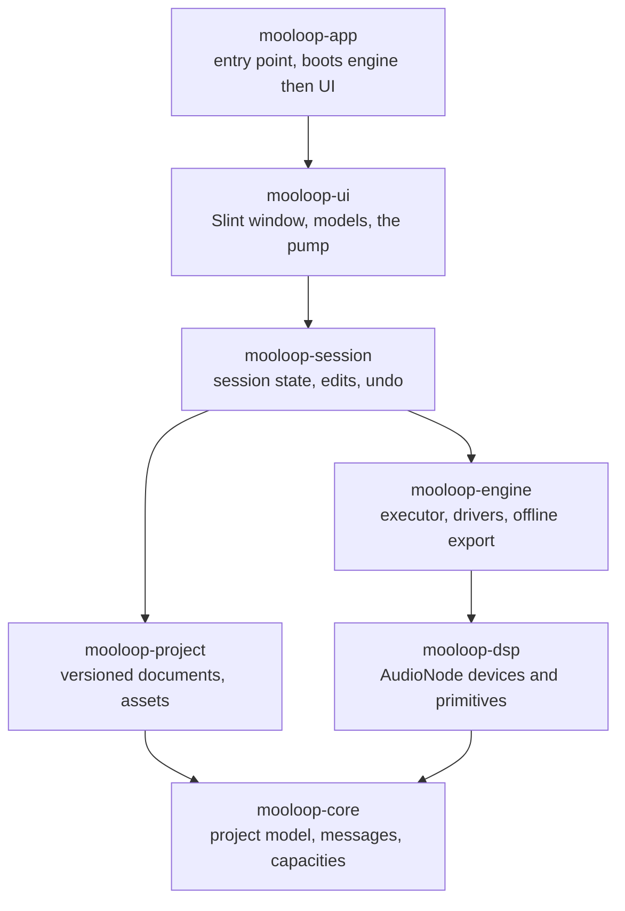
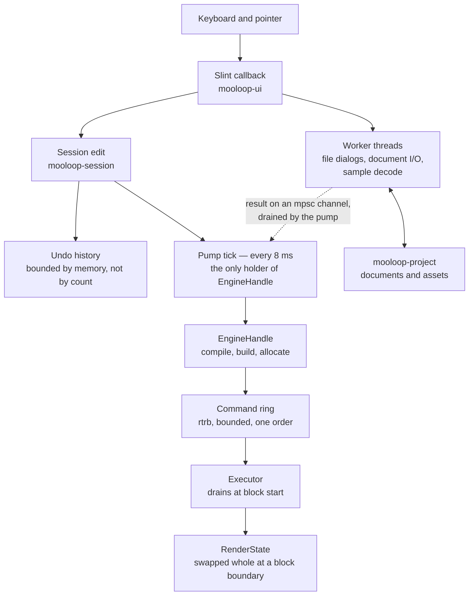
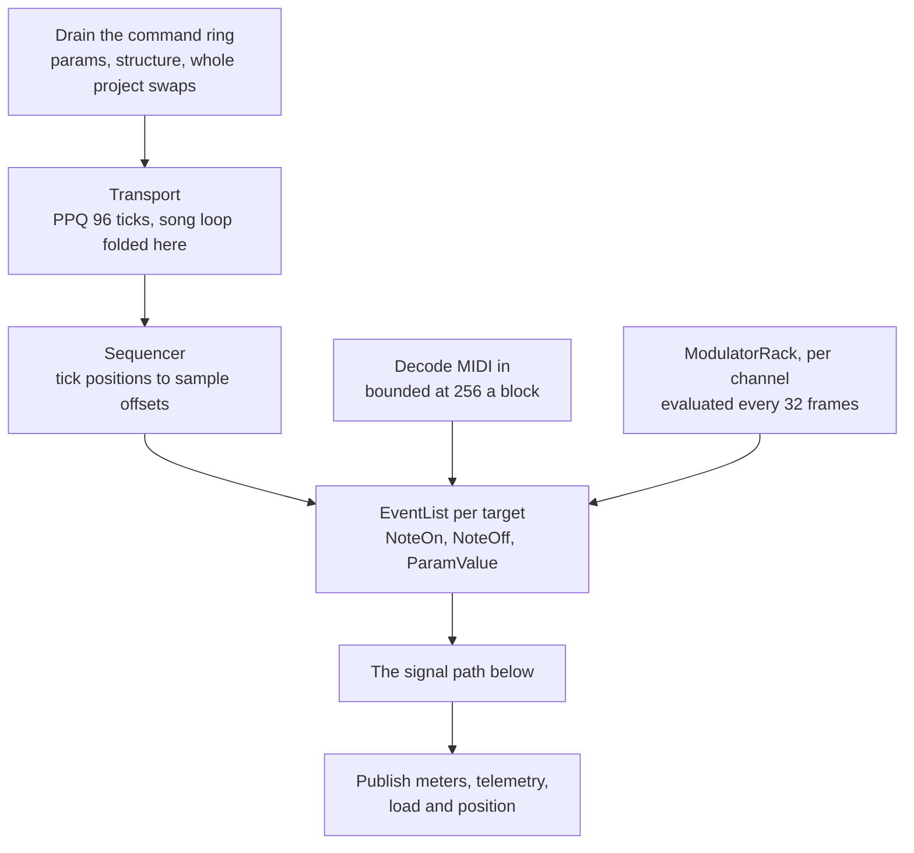
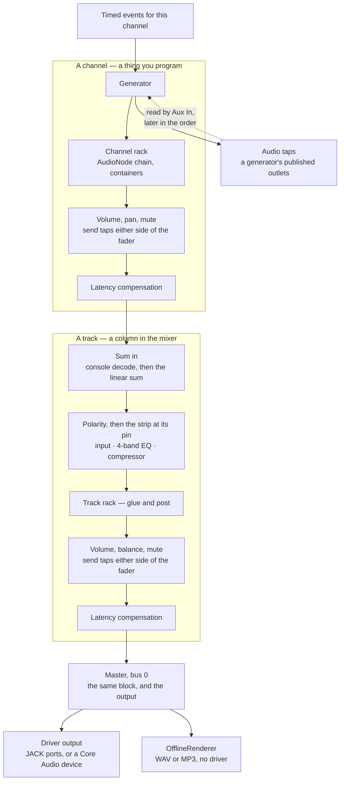
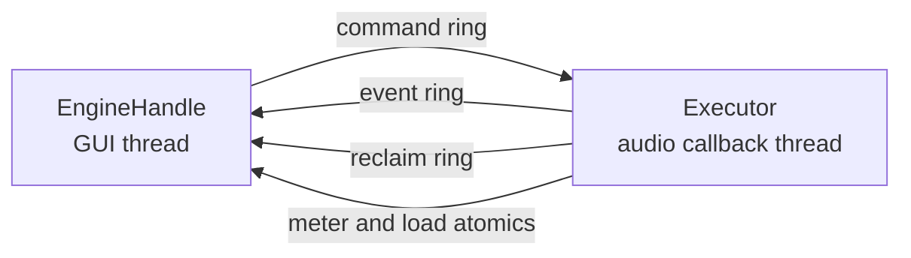

# Application Structure And Flow

Status: implementation map, September 2026.

The high-level map of Mooloop as it exists today: which crate owns what, how
an edit reaches the audio thread, what the audio thread does with it, and what
is allowed to cross between the two.

This used to be one diagram, and it rendered about 4500 pixels wide against
700 tall. Nothing that shape gets read whole, and what is not read whole gets
patched a line at a time instead: the driver box was correctly updated for
Core Audio while, in the same picture, the UI still owned the project
`mooloop-session` had taken over, an engine control thread that has never
existed still sat inside the engine, and every track was still called a bus
after `TERMINOLOGY.md` settled that word. Five diagrams replace it, none wider
than about 900 pixels. Each is meant to fit on a screen, and each is meant to
be wrong in a way somebody can spot.

The detailed audio-core contract stays in `AUDIO_ARCHITECTURE.md`; the mixer
and device details stay in `CURRENT.md`.

## The Crates

Only the defining edge out of each crate is drawn, and the real graph has more
in it: `mooloop-ui` names `mooloop-engine`, `mooloop-dsp`, and `mooloop-core`
directly as well as `mooloop-session` and `mooloop-project`; `mooloop-session`
names all four beneath it; `mooloop-app` names the engine, dsp, and core
alongside the UI. `Cargo.toml` is the authority. What the diagram states is the
layering — nothing points upward, and `mooloop-core` points nowhere.

- **`mooloop-core`** is the dependency-light source of truth for musical and
  project state, plus the message types that cross to the engine. Its only
  dependency is `serde`. Everything else shares its model rather than
  translating between private representations.
- **`mooloop-dsp`** supplies generators, insert effects, the channel strip,
  the modulator rack, and the shared primitives they are built from, behind
  the one `AudioNode` in-place stereo interface.
- **`mooloop-engine`** owns the realtime side: `RenderState`, the transport
  and sequencer, compiled routing, meters, the driver adapters, and offline
  export. `EngineHandle` is its non-realtime face.
- **`mooloop-project`** owns durable documents — song, kit, channel,
  generator, effect, effect run — their versioning, integrity checks, and
  sample-asset handling.
- **`mooloop-session`** is the live application model: channels, patterns,
  playlist, selection, gesture state, undo, and the code that turns an edit
  into engine commands. It has no `slint` dependency, and that absence is the
  boundary — the session speaks `String` and `PathBuf`, and the view converts.
- **`mooloop-ui`** owns the window and nothing else that matters: Slint
  models, callbacks, gestures, and the 8 ms pump. It projects the session into
  models and never the other way round.
- **`mooloop-app`** starts the engine, hands the handle to the UI, and runs
  the Slint event loop.

## An Edit's Path To The Audio Thread

- A callback mutates the `Session` and records an undo entry. It does not
  touch the engine: edits and POD commands share one ordered queue into the
  pump, because separate relay paths lost their relative order.
- The pump is the control plane. There is no engine-owned control thread —
  `EngineHandle` runs on the GUI thread, and project installation, graph
  compilation, node construction, and every allocation happen there before
  anything is published. A full command ring leaves the prepared object on
  the GUI thread, where dropping it is safe.
- An undo cursor moves only once the engine has accepted the replacement
  state, so undo cannot claim something the speakers disagree with.
- Anything that can block — a file dialog, a save, a decode — runs on a
  spawned worker and returns its result through a channel the pump drains.

## What One Block Does

- MIDI in reaches the engine, not the UI: the driver hands the executor its
  block of messages and `RenderState` decides what they are. A note is
  auditioned on the keyboard channel unless a Buffer insert's note or CC map
  claims it, in which case it is a gesture for that device instead.
- The transport folds the song loop, so nothing below it learns that looping
  exists. The price is that one block can span the loop point and is therefore
  a short ordered list of musical stretches rather than one.
- The modulator rack is not an `AudioNode`. It produces control values, which
  the engine resolves against each destination's base and emits as ordinary
  sample-timed `ParamValue` events — so no device knows it is being modulated.
  Its pass stays in index order and stays a separate loop: an LFO's phase must
  not depend on somebody else's routing.
- Devices and channels with nothing to do are not rendered. Waking is the
  first block with audio in it, from the state the device had when it stopped
  — nothing is reset and nothing ramps.

## Where The Signal Goes

`TERMINOLOGY.md` is the vocabulary and it is not the usual one: a **channel**
is a slot in the sequencer, a **track** is a column in the mixer, and *bus* and
*send* are roles a track is being used as rather than kinds of thing. The code
still says `MixerBus` and `EffectTarget::Bus` where this says track.

- A channel's generator is one of eight: the sampler, the drum synth, DS-01,
  the v1 mono synth, ML-M1, ML-P8, the v1 poly synth, or Aux In — whose sound
  is another channel's published audio outlet. Every strip preallocates every
  one of them and switches without allocating in the callback. `CURRENT.md`
  describes what each is.
- **Nothing sorts a graph on the audio thread.** Channels render in a compiled
  order and tracks in a compiled schedule, both produced off the thread — the
  callback only walks them. A project with no subscriptions compiles to the
  identity order and allocates no tap buffers, so the schedule is provably
  inaudible until an edge is authored.
- The strip's position is `mooloop_core::mixer::STRIP_PIN`, one statement read
  by both the audio loop and the rack's drawing. It is `Head` today, so a
  track's own devices run *after* its EQ and compressor.
- A track's output may feed another track; the compiled order guarantees
  everything feeding a track has already run when the track's block starts.
  Cycles are refused rather than delayed.
- Sends leave a channel or a track at either tap, are compensated on their own
  edge, and arrive at another track's summing point. A send is a route, not a
  kind of track: the thing at the far end is an ordinary track that happens to
  be fed by sends.
- Summing runs through the console non-linearity where a track opts in: a
  curve on the way out of a track and its exact inverse on the way in to the
  summing point, so a track alone has no sound of its own and several
  interact. It is a track's switch and only a track's.
- Realtime and offline share this path exactly. The driver is an output
  adapter chosen at compile time — JACK, and PipeWire's JACK layer behind it,
  everywhere but macOS; Core Audio through `cpal` on macOS — and it owns no
  musical semantics.

## What Crosses The Realtime Boundary

- **Command ring**, GUI to audio. Parameter and transport commands,
  structural installs, and whole prepared projects. One ring, because two lost
  their relative order; bounded and non-blocking, and an overflow is
  observable to the sender rather than a silent divergence between what is
  visible and what is audible.
- **Event ring**, audio to GUI. Position, acknowledgements, engine notices.
  Low rate, and the backlog is the point.
- **Reclaim ring**, audio to GUI. Displaced nodes, render states, sample and
  stretch pools, compensation rings, container scratch. The audio thread
  hands boxes back; the pump drops them. Nothing is freed on the callback.
- **Meter atomics**, audio to GUI. Per-track and per-device peak, strip gain
  reduction, playhead positions, modulator values, spectra. Deliberately not
  the event ring: these are produced once per track per block, the GUI only
  ever wants the most recent reading, and a queue would carry the backlog it
  does not want. The value is peak-held and cleared by the reader, so a
  transient landing between two frames is still seen.
- **Load atomics**, audio to GUI. Callback work time, wake-up period, xruns,
  and whether the thread actually got realtime scheduling. An xrun is the last
  symptom rather than the first; work time against the block budget and the
  gap between callbacks separate "the engine is doing too much" from "the OS
  did not run the thread", which are different faults with different fixes.

## Current Constraints

The callback must remain allocation-free, lock-free, and free of I/O. Queues
are bounded, structural state is prepared before activation, and displaced
state is reclaimed on the control thread. Capacities are compile-time
constants with a measured price, not product limits — see `CAPACITY_POLICY.md`
for why a ceiling is not a reservation. See `AUDIO_ARCHITECTURE.md` for the
full contract and the planned evolution of compiled routing, latency
compensation, and sidechains.
