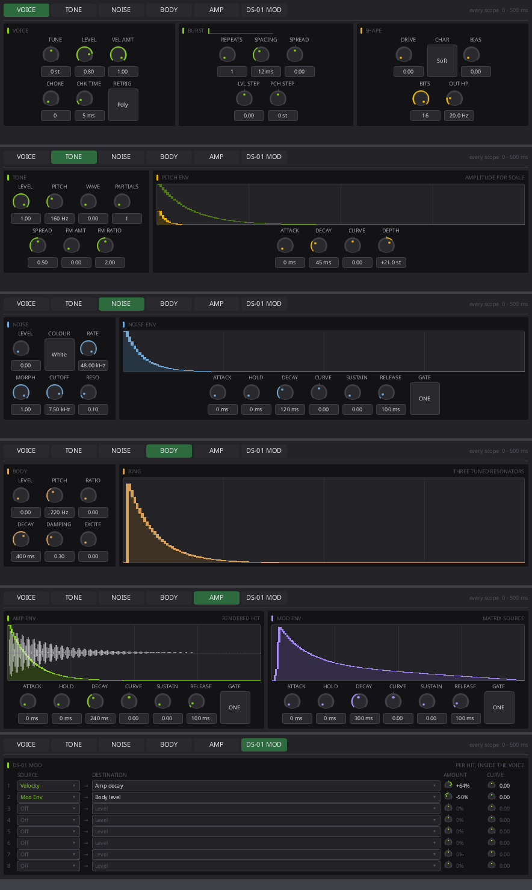
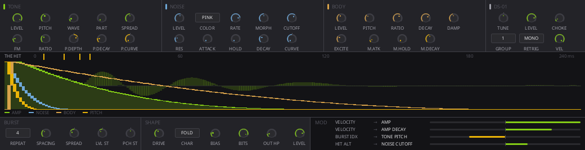

# DS-01 face concepts

Four renderings, at the real face size. The first three are one-screen
concepts at 1040 x 268 (`DeviceRackMetrics.face-height` is 268px); the fourth
is the shipped face, six pages of 884 x 240. They import the real widgets from
`crates/mooloop-ui/ui`, so spacing, type, and colour are honest; the values
are literals and nothing is wired to anything.

Re-render any of them without building the UI crate:

```sh
scripts/slint-sketch --shot docs/plans/drum-synth-v2/mockups/concept-columns.slint
```

`docs/AGENT_OPERATIONS.md` says sketches belong in `$TMPDIR` rather than in the
repository, and it is right about working sketches. These are checked in on
purpose because they are the argument for a layout decision rather than notes
from making one, and two of the three are the reasons the third was chosen.

## D: pages — shipped



**Adam's ruling, 2026-09-04.** Concept C is what got built first, and it fit
only by making the scopes the envelope editor — envelope times as handles on a
curve rather than knobs — with everything else at a 21px dial and an 8px
caption. That is the trade ML-P8's first face made and Adam rejected on a 14"
laptop, reached from the other direction, so DS-01 spends pages the way ML-P8
now does.

Six of them: **VOICE · TONE · NOISE · BODY · AMP · DS-01 MOD**. Every one of
the ninety-two parameters has a control of its own, at the 34px `KnobStack`
the rest of the program uses, with its value typed into. The scopes are
displays again — no handles — and their shared span is stated once in the page
bar rather than once per page.

What concept C settled survives: how the device divides, which layers are
peers, and that a layer's display belongs beside the controls that make it.
What it got wrong is that the division had to fit at once. It reached "DS-01's
controls do not fit on one face unless the scopes are the envelope editor" and
took that as a licence; it is a warning. A device that only fits by deleting
its knobs wants a page.

Three placements the pages had to decide that the columns never did:

- **The mod envelope is on the AMP page, beside the amplitude one**, not on
  the matrix page. It is an envelope, it is drawn like one, and eight matrix
  rows want the whole height of a page.
- **The globals share the VOICE page with the burst and the shaper**, because
  none of the three is a layer. A permanent header strip was the alternative
  and it costs every page the space that pages were adopted to buy back.
- **The matrix is a page, not a panel.** Eight rows of source, destination,
  amount and curve at full width, with `PickerChip` on both ends because nine
  sources and forty-seven destinations are past what a cycling chip carries.
  This is the thing `00-status.md` recorded as undecided; the answer turned
  out to be that it needed room rather than a cleverer arrangement.

The face is **four** rack units now, not five. The fifth existed to make one
screen fit.

This rendering imports the shipped `Ds01DeviceFace` rather than
reimplementing it, so it cannot drift from what is built: re-run
`scripts/slint-sketch --shot docs/plans/drum-synth-v2/mockups/concept-pages.slint`
after a layout change and the picture is current.

## C: columns — superseded


Adam's proposal, built, and then replaced by D. Its grouping is what the pages
inherit; its fit is what D overturns. **Each layer's scope sits directly
underneath the controls that make it.** TONE, NOISE and BODY are drawn as
parallel columns because they are parallel in the signal path; AMP is the
fourth column because the summed output is what its envelope shapes, and the
rendered hit is what its scope draws.

Two things it gets that neither of the others did.

**The layout is the signal path.** Three sources side by side, their sum on
the right, the shaper and the matrix in a band underneath. Concept A's rows
implied a sequence between the layers that does not exist.

**The scope becomes the editor.** A display sitting directly under its own
controls can carry that envelope's handles, which is what took the envelope
*times* off the knob rows — the dots on each curve are attack, decay, and
pitch depth. That is not a nicety; it is what makes the device fit:

| | cells |
| --- | --- |
| Four columns, two rows of four | 32 |
| Header globals | 5 |
| BURST and SHAPE bands | 11 |
| Envelope times, on the scopes | 13 |
| **Total** | **61** |

DS-01 has roughly 55 controls. Every earlier layout was quietly showing about
two thirds of them and would have needed a page or a scroll. This one has
room to spare.

The three source scopes share one span, stated once in the header, with
matching gridlines, so a shorter contour is a shorter contour rather than a
different scale.

### As it was built, before D replaced it

It shipped in `crates/mooloop-ui/ui/ds01-device.slint` for a day, and departed
from the rendering above in three measurable ways. Kept because two of the
three are what the pages had to answer:

- **Five rack units, not a literal 1040 px.** A source device was three units
  wide for every kind; DS-01 was the first to declare its own, the way an
  effect slot does. Five was the width at which "one screen, no pages" was
  true. The mechanism outlived the number: the face is four now.
- **The columns were not equal.** TONE, NOISE, BODY and AMP took 4, 5, 3 and 4
  units of the row, because that is how many cells they had. That is the shape
  of the problem D solves: a layout whose columns must be sized by cell count
  has no slack anywhere, and the next control added to any of them takes width
  from a neighbour.
- **The header carries controls rather than a summary.** The concept drew
  "TUNE +0 st" as text. Those five globals are parameters and have to be
  editable, so they are chips and knobs with their captions beside them rather
  than under them, which costs eight pixels of header and buys them back in
  every scope below.

## A: lanes — rejected


Each layer got a row: controls on the left, contour on the right, one
continuous axis down the panel. It solved concept B's legibility problem and
was the adopted layout until C existed.

Two faults. Stacking parallel layers as rows implies an order they do not
have. And with the scope beside its controls rather than under them, it never
occurred to the layout to make the scope an editor — so it fitted its knobs by
showing seven per lane and leaving the rest out.

## B: overlay — rejected



The layout `08-the-face.md` originally described: three source columns above
one shared display with every envelope drawn on top of the others.

- **Four contours and a waveform in one ninety-pixel box is soup.** The curves
  cross each other and the trace, the fill of the focused one hides the rest,
  and it needs a legend to say which curve is which — which is the admission
  that the picture failed.
- **The source columns come out as twenty-six near-identical small knobs in a
  grid.** That is the "pages of knob rows" that got rejected on ML-P8's first
  face, arrived at from a different direction.

Kept rather than deleted, because the reason a layout was not chosen is worth
as much as the one that was — and because B's second fault is the one D had to
keep avoiding. Pages are not a licence for pages *of knob rows*: a page is a
few large controls inside modules that share one chrome.
`docs/plans/poly-synth-v2/mockups/README.md` makes the same argument for
ML-P8, and it is the same rule.
