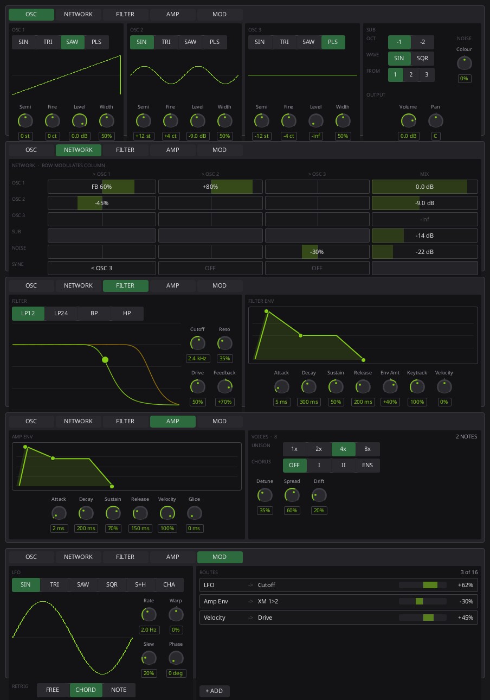

# ML-P8 face concepts

One rendering of the face at its real size (884 x 240, which is four rack
units of `DeviceRackMetrics` minus the two rails, by `face-height` minus the
device header). It imports the real widgets from `crates/mooloop-ui/ui`, so
spacing, type and colour are honest; the values are literals and nothing is
wired to anything.

Re-render it without building the UI crate:

```sh
scripts/slint-sketch --shot docs/plans/poly-synth-v2/mockups/concept-pages.slint
```

`docs/AGENT_OPERATIONS.md` says sketches belong in `$TMPDIR` rather than in the
repository, and it is right about working sketches. This one is checked in
because it is the argument for a layout decision rather than notes from making
one.

## Pages — adopted



The shipped face was one screen. It fitted ML-P8's sixty-nine parameters at
four rack units only by shrinking every control to a 20px dial with a 9px
caption, and Adam's verdict on a 14" laptop was that the cutoff knob is a
smudge — "might be ok on a 24 inch screen but not 14".

So the face spends pages, the way the v1 mono and poly faces do, and every
control is the 34px dial the poly face already uses. **OSC · NETWORK · FILTER
· AMP · ML-P8 MOD.**

The failure this had to avoid is the one `docs/plans/drum-synth-v2/mockups`
names: "pages of knob rows", twenty-six near-identical small knobs per page,
which is what got ML-P8's *first* face rejected. The current face is that same
failure arrived at from the other direction — one screen of small knobs rather
than five pages of them. So the rule here is that a page is a few large
controls inside modules that share one chrome, and a display is sized by what
it has to show rather than by whatever width was left over.

### What the iterations fixed

Three rounds, all of them Adam's notes:

- **Negative space and misalignment.** The first pass had a narrow fourth
  column trailing off the right of the OSC page, accent borders on every live
  network cell *and* a fill behind it, and a grid whose column heads were laid
  out separately from its rows. The cells are wells with quiet borders now, and
  the concept's grid is one `GridLayout` so heads and rows share their columns
  by construction. Levels fill from the left and amounts from the centre,
  because a level has no negative half to be on the other side of.
- **"Too much space for too little stuff."** The filter response had the whole
  page width and the filter envelope had a corner, which said they were not
  equally important; the amp envelope on the next page was four times the size
  of the filter one. They are peers at the same size now, and the response sits
  *beside* a 2x2 of its knobs rather than being a 420px picture of one curve.
  The structural cause was a `TitledModule` whose `@children` landed inside its
  title row, collapsing two pages onto one line.
- **Envelopes needed knobs, not only handles.** Both envelope editors keep
  their draggable handles and gained explicit A/D/S/R knobs, because a handle
  is quick and a number is exact.

### As built

The face in `crates/mooloop-ui/ui/mlp8-device.slint` is this layout, and
departs from the rendering in ways worth recording:

- **`KnobStack` had to be written.** `ParameterKnob` stacks a label and a value
  around a big dial but the value is read-only; `KnobField` makes the value
  typed into but lays the three parts in a *row*, 130px wide at a legible dial
  size. ML-P8 has typed entry on every control, so swapping wholesale to
  `ParameterKnob` would have removed it. `KnobStack` is both, and its dial is a
  real `ParameterKnob` with its own captions off, so the drag, wheel,
  double-click-to-default and modulation-arming contract is the shared one.
- **The sync LED moved onto it.** `SyncMiniKnob` is 46x51 with a 22px dial, so
  the LFO's Rate was visibly smaller than the four knobs beside it.
  `KnobStack` grew an optional sync LED beside its caption instead.
- **The network grid was not redrawn.** It is absolutely placed off four
  constants, so giving it a page meant changing `cell-w` from 46px to 176px.
  The concept reimplemented it; the real one was already right.
- **The device grew an output stage.** Adam asked for master volume and pan.
  They are new parameters (69, 70) and they earn their place: `VcaLevel` and
  `Pan` were already per-voice modulation destinations resolving from
  *hardcoded* unity and centre, so a Velocity route on Pan swung around dead
  centre whatever the patch wanted. They are the authored base now, and Spread
  widens around wherever the device sits.
