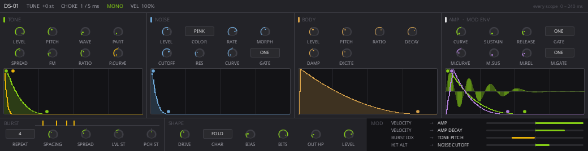
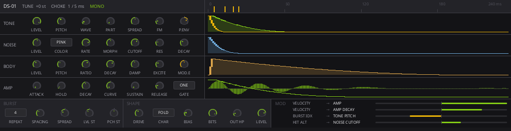

# DS-01 face concepts

Three renderings of the same instrument, at the real face size (1040 x 268,
where `DeviceRackMetrics.face-height` is 268px). They import the real widgets
from `crates/mooloop-ui/ui`, so spacing, type, and colour are honest; the
values are literals and nothing is wired to anything.

Re-render any of them without building the UI crate:

```sh
scripts/slint-sketch --shot docs/plans/drum-synth-v2/mockups/concept-columns.slint
```

`docs/AGENT_OPERATIONS.md` says sketches belong in `$TMPDIR` rather than in the
repository, and it is right about working sketches. These are checked in on
purpose because they are the argument for a layout decision rather than notes
from making one, and two of the three are the reasons the third was chosen.

## C: columns — adopted



Adam's proposal, and the right one. **Each layer's scope sits directly
underneath the controls that make it.** TONE, NOISE and BODY are drawn as
parallel columns because they are parallel in the signal path; AMP is the
fourth column because the summed output is what its envelope shapes, and the
rendered hit is what its scope draws.

Two things it gets that neither of the others did.

**The layout is the signal path.** Three sources side by side, their sum on
the right, the shaper and the matrix in a band underneath. Concept A's rows
implied a sequence between the layers that does not exist.

**The scope becomes the editor.** A display sitting directly under its own
controls can carry that envelope's handles, which is what took the envelope
*times* off the knob rows — the dots on each curve are attack, decay, and
pitch depth. That is not a nicety; it is what makes the device fit:

| | cells |
| --- | --- |
| Four columns, two rows of four | 32 |
| Header globals | 5 |
| BURST and SHAPE bands | 11 |
| Envelope times, on the scopes | 13 |
| **Total** | **61** |

DS-01 has roughly 55 controls. Every earlier layout was quietly showing about
two thirds of them and would have needed a page or a scroll. This one has
room to spare.

The three source scopes share one span, stated once in the header, with
matching gridlines, so a shorter contour is a shorter contour rather than a
different scale.

### As built

The face shipped in `crates/mooloop-ui/ui/ds01-device.slint` is this layout,
and departs from the rendering above in three measurable ways. They are
recorded here rather than re-rendered, because a second copy of a layout that
now exists for real is a second thing to keep true:

- **Five rack units, not a literal 1040 px.** A source device was three units
  wide for every kind; DS-01 declares five, the way an effect slot declares
  its own. Three is the width at which "one screen, no pages" stops being
  true, and the rack scrolls horizontally anyway — ML-P8 spent the same
  problem on a second page instead.
- **The columns are not equal.** TONE, NOISE, BODY and AMP take 4, 5, 3 and 4
  units of the row, because that is how many cells they have: the noise layer
  carries ten and the body six. Equal columns would have meant a different
  knob size per column, or leaving two of the noise layer's controls out — the
  failure this whole plan refuses.
- **The header carries controls rather than a summary.** The concept drew
  "TUNE +0 st" as text. Those five globals are parameters and have to be
  editable, so they are chips and knobs with their captions beside them rather
  than under them, which costs eight pixels of header and buys them back in
  every scope below.

## A: lanes — rejected



Each layer got a row: controls on the left, contour on the right, one
continuous axis down the panel. It solved concept B's legibility problem and
was the adopted layout until C existed.

Two faults. Stacking parallel layers as rows implies an order they do not
have. And with the scope beside its controls rather than under them, it never
occurred to the layout to make the scope an editor — so it fitted its knobs by
showing seven per lane and leaving the rest out.

## B: overlay — rejected


The layout `08-the-face.md` originally described: three source columns above
one shared display with every envelope drawn on top of the others.

- **Four contours and a waveform in one ninety-pixel box is soup.** The curves
  cross each other and the trace, the fill of the focused one hides the rest,
  and it needs a legend to say which curve is which — which is the admission
  that the picture failed.
- **The source columns come out as twenty-six near-identical small knobs in a
  grid.** That is the "pages of knob rows" that got rejected on ML-P8's first
  face, arrived at from a different direction.

Kept rather than deleted, because the reason a layout was not chosen is worth
as much as the one that was.
